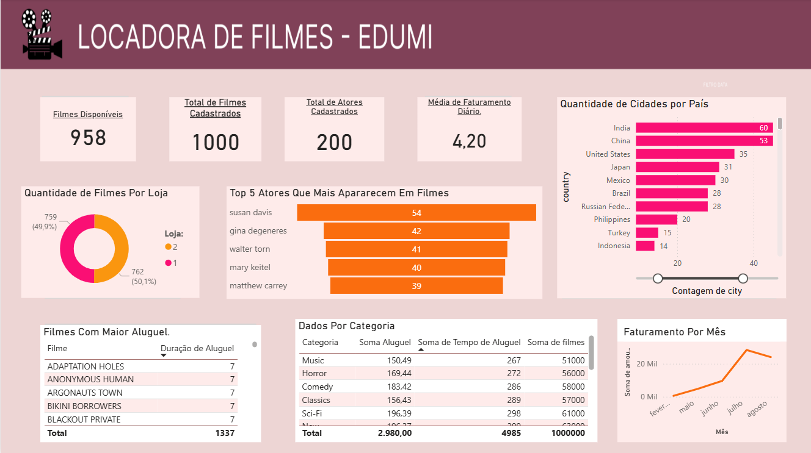

# Dashboard locadora_filmes

## 📊 Objetivo
Analisar os dados de uma locadora de filmes utilizando SQL, com o objetivo de compreender o comportamento de locação, identificar os filmes mais alugados, tempo de locação dos filmes, faturamento mensal e melhores atores.

## 🧰 Ferramentas
- SQL
- Power BI
- Excel

## 📌 Principais insights
- Locais com as melhores locações de filmes
- Categorias com maior volume de aluguel
- Identificação de títulos com baixa rotatividade no catálogo

## 🗄️ Consultas SQL
- Joins entre tabelas de filmes, categorias e locações
- Agregações para cálculo de volume de locações
- Ordenação e filtros para ranking de filmes
